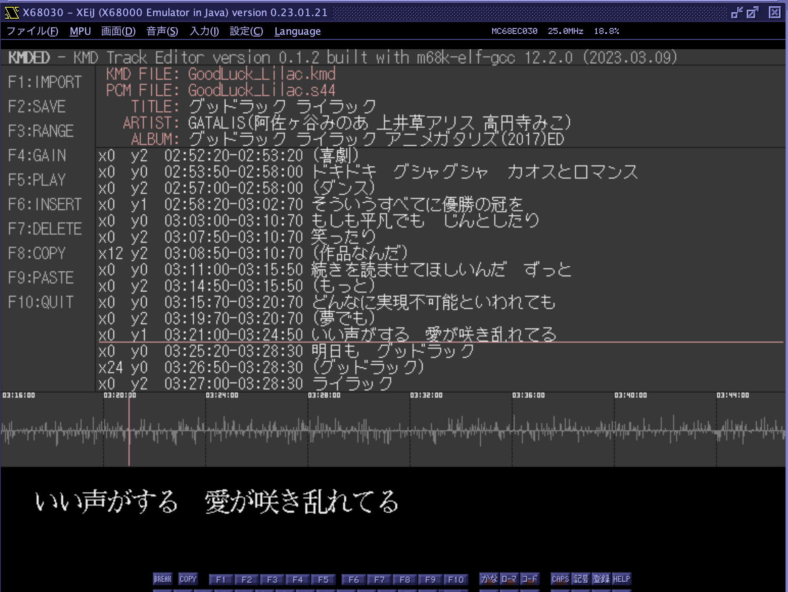
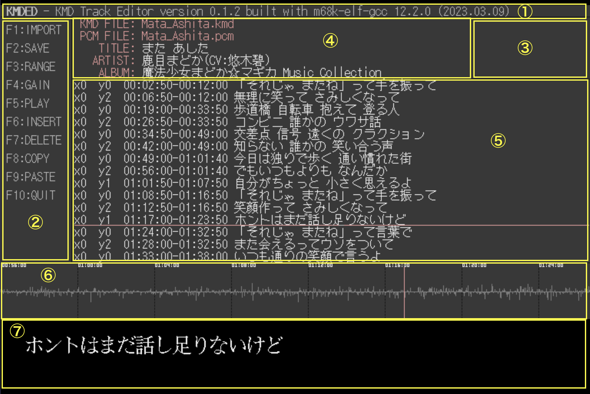

# KMDED.X
KMD Track Editor for X680x0/Human68k

KMD歌詞データ編集に特化したステップ入力式のシーケンサ風エディタです。

KMDデータフォーマットはSMR.X作者のYas氏により提案されたもので、以下のプログラムでPCM曲再生時にタイミングを合わせた歌詞表示に利用できます。

* SMR.X (1997年最終版)
* [S44EXP.X](https://github.com/tantanGH/s44exp)
* [S44BGP.X](https://github.com/tantanGH/s44bgp)

---

### インストール方法

KMDEDxxx.ZIP をダウンロードして展開し、KMDED.X をパスの通ったディレクトリに置きます。

KMDED.X を動作させるには phillyさんの PCM8A.X が必要になります。PCM8Aの拡張機能を利用しているため、バージョン1.02以上を導入してください。X68000 LIBRARY からダウンロードできます。

[PCM8A.X](http://retropc.net/x68000/software/sound/adpcm/pcm8a/)

注意：オリジナルのPCM8.Xでは動作しません。PCM8PP.Xには対応していません。

注意：開発およびエミュレータ・実機での動作確認は X68030 25MHz を念頭においています。低クロック機では期待通りに動作しない可能性があります。

---

### INS(挿入)モードに関して

KMDED.X は起動時にINSモードをONにします。ただし、ASK68Kで日本語入力モードに入るとINSモードではなくなってしまいます。これはASK68Kの既知の問題になります。
この問題はM.Kamada-sanの KeyWitch.X を -a オプションをつけて組み込むことで回避できます。

    KeyWitch.X -a

KeyWitch.X は X68000 LIBRARYからダウンロードできます。

[KeyWitch.X](http://retropc.net/x68000/software/system/key/keywitch/)

---

### 割り込みに関して

KMDED.X はできるだけタイミングを厳密に取るために、Timer-A/D の割り込みを両方とも使用します。これらの割り込みを使う常駐プログラムなどと一緒に動作させることはできません。

また、Timer-Dを使うHuman68k のバックグラウンド機能も利用できません。CONFIG.SYS で PROCESS= の行が有効になっている場合は、本プログラム利用時はコメントアウトする必要があります。

---

### 起動方法

    kmded <KMDファイル名>

コマンドラインで編集対象となるKMDファイル名を指定して起動します。ファイルが存在しない場合には新規で作成するか聞いてきます。

また、KMDファイルと同じ主ファイル名で以下の形式のPCMデータがあれば、それを読み込んで実際に音を聴きながら編集作業を行うことができます。

- .pcm (X68k MSM6258V ADPCM 15.625kHz mono)
- .m32/.m44/.m48 (16bit signed big endian PCM mono)
- .s32/.s44/.s48 (16bit signed big endian PCM stereo)

いずれの形式であっても、8bit 15.625kHz mono PCMデータに変換してメモリ上に抱えますので、読み込み負担の小さい .pcm か .m32 形式に NOZさんの PCM3PCM.X などで事前に変換しておくのをお勧めします。

そういうことでメモリは12MBフル実装してあることがほぼ前提となりますw

---

### 画面構成

画面は以下のように7つのエリアがあります。

1. バージョン表示

バグ修正や改良されたバージョンを短期間でリリースする可能性がありますので、常に最新版を使うようにお願いします。

2. ファンクションキー機能表示

F1 ~ F10 の各ファンクションキーに割り当てられた機能一覧です。

3. PCM再生モード時の情報表示

PCM再生モード(後述)で補足情報が表示されます。

4. ファイル名・タグ情報表示

KMDEDはKMDファイルの最後に確実に再生されないであろう時間設定にてタグ情報(曲名・アーティスト名・アルバム名・アートワークファイル名)を埋め込むことができます。あくまでKMDフォーマットの枠内で歌詞の一部として埋め込まれますので、SMR.Xでも再生エラーになることはありません。MP3EXP.Xではこのタグ情報やアートワークを表示することが可能です。

5. KMDイベントリスト

KMDED.X では KMDファイル内の各行のことを「イベント」と呼んでいます。

6. PCM波形表示

PCMデータを読み込んだ場合は波形が表示されます。4000msec(4秒)ごとに点線で仕切りと時間が表示されます。

7. 歌詞表示エリア

SMR.X の仕様に従い、24x24フォントを使い、12ドットずつずれた縦3段指定になります。真ん中の段は上下段と12ドットずつ重なりますので、同時に表示できるのは2段までとなります。

---

### 操作方法(基本モード)

ファンクションキーごとの操作は以下になります。

1. F1(IMPORT) / iキー

外部テキストファイルを読み込んで現在編集中のイベントリストの最後に行を追加します。
テキストファイルの文字コードはShift-JIS(CP932)のみ対応しています。
改行コードはCRLFでもLFでも構いません。末尾のEOFコードが無くても構いません。

追加したイベントの時間は元の最後のイベントの開始時間・終了時間に4秒ずつ足していった仮のものが自動的に割り振られます。

2. F2(SAVE)

編集中のKMDファイルを上書き保存します。別名保存には対応していません。また、バックアップファイルを生成したりもしないので、大事なファイルを編集する前には個別にバックアップを取っておいてください。

なお、KMDファイル保存の際、各イベントの歌詞メッセージの最後に空白文字が意図的に足されます。
これは SMR.X で歌詞消去がうまくいかない場合があることに対する回避策です。

3. F3(RANGE)

PCM波形表示の時間方向の縮尺を変更します。波線による4秒区切りのルールは変わりません。

4. F4(GAIN)

PCM波形表示の高さ方向の縮尺を変更します。実際の再生時の音量にも反映されます。

5. F5(PLAY)

再生モード(後述)に入ります。

6. F6(INSERT)

現在のカーソル位置に一行イベントを挿入します。

7. F7(DELETE)

現在のカーソル位置のイベントを削除します。

8. F8(COPY)

現在のカーソル位置のイベントをクリップボード(的なもの)にコピーします。

9. F9(PASTE)

現在のカーソル位置にコピーされたイベントを挿入します。

10. F10(QUIT) / qキー

KMDEDを終了します。確認を求められます。

ファンクションキー以外の操作は以下になります。

11. カーソルキーの上下(左右)

カーソルバーを上下に移動します。左右でも同じ動きになります。
PCMデータを読み込んでいる場合は、カーソル位置のイベントの開始時刻に対応した波形位置にPCMカーソルバー(縦ライン)も表示されます。

イベントリストの一番上にカーソルがある状態でさらに上を押すとタグ部分にカーソルを移動することができます。

なお、以下でも同じ操作になります。

* emacsバインド CTRL+p, CTRL+n
* vi/lessバインド j, k

12. リターンキー / CTRL+m

カーソル位置にあるイベントもしくはタグを編集するモードに入ります。

* TABキー/カーソルキー左右 ... 項目間移動
* カーソルキー上下 ... 値の上下
* 数字キー ... 数値直接入力
* DEL/BSキー ... 入力削除
* eキー ... 終了時刻編集位置で押すと一つ上のイベントの終了時刻をコピーする
* dキー ... 終了時刻編集位置で押すと一つ下のイベントの終了時刻をコピーする
* sキー ... 終了時刻編集位置で押すと一つ下のイベントの開始時刻-150msを終了時刻としてコピーする

リターンキーを再度押すと編集内容を確定します。ESCキーを押すと破棄します。

KMDの仕様では、歌詞は1行62文字(半角)まで可となっていますが、画面構成の都合とSMR.Xでの文字化け回避のため、KMDED.Xでは最大60文字までとしています。

13. ROLLUPキー / CTRL+v / SPACE

ページ送りをします。

14. ROLLDOWNキー / CTRL+b / b

ページ戻しをします。

15. HOMEキー / '<' キー

カーソルをイベントリストの先頭に移動します。

16. '>' キー

カーソルをイベントリストの最下行に移動します。

17. q キー

F10(QUIT)と同じ

---

### 操作方法(再生モード)

起動時にPCMデータを読み込んであるならば、基本モードでF5キーを押すと再生モードになります。
現在選択されているイベントが含まれる一つ前のチャンク(4秒のかたまり)の先頭から再生されます。

再生時には波形上のカーソルが黄色になります。また、イベント編集モードとは異なり、複数のイベントメッセージもタイミングにあわせて表示されます。

再生中は以下の操作ができます。

- ESCキー ... 再生終了
- スペースキー ... 一時停止および再開
- mキー ... 指定箇所にマーカーを設置する
- リターンキーまたはtキー ... 指定箇所にマーカーを設置すると共に、現在のイベント以降の開始時刻をマーカー設置時刻-0.4sに設定する

曲の最後まで再生しきると自動的に基本モードに戻ります。

マーカーは紫色のラインで表示されます。ここぞというタイミングのところにマーカーを置けば、イベント編集モードでそれを頼りにタイミングの微調整を図ることができます。マーカーは再生後に SHIFT+m を押すとクリアされます。

---

### KMD作成のコツ

- 歌詞入力はあらかじめWindows/Macなどで行いテキストファイルにしておく

F1(IMPORT)機能を使ってあらかじめテキストファイルに打ち込んでおいた歌詞を取り込み、KMDEDでの作業はタイミング調整中心に行うと良いでしょう。
また、できあがったKMDファイル自体はテキストファイルですので後でWindows/Macのテキストエディタで再編集することもできます。
ただし、取り込むことのできるテキストファイルの文字コードはShift-JIS(CP932)だけですので、特にMacユーザは気をつけてください。

- 再生モードのtキーを使って開始時刻を入れていく

時刻を一つ一つ手入力していくのはかなり大変です。F5で再生し、イベントごとにtキーを押して行くだけで開始時刻を自動的に埋めることができます。あとは終了時刻を調整するだけです。

- 終了時刻入力時にショートカットキーを使う

s,d,eのショートカットキーを活用すると、イベント終了時刻数値入力の手間を大幅に減らすことができます。

- 自動生成される空イベントは残しておく

新規KMDファイルを作成した際、KMDEDは自動的に3行の空行イベントを先頭に生成します。
これは SMR.X アルバムモードの時に画面クリアされないことに対する回避策ともなっています。
そのため編集せずにそのまま残しておき、その後に新規イベントを追加していくことをお勧めします。

---

### Special Thanks

* KMDデータ資料およびサンプルデータ提供 thanks to かきうちさん
* デバッグ協力 thanks to X68PROさん / かきうちさん
* xdev68k thanks to ファミべのよっしんさん
* HAS060.X on run68mac thanks to YuNKさん / M.Kamadaさん / GOROmanさん
* HLK301.X on run68mac thanks to SALTさん / GOROmanさん
* XEiJ / KeyWitch.X thanks to M.Kamadaさん
* XM6 TypeG thanks to PI.さん / GIMONSさん
* PCM8A.X thanks to phillyさん

---

### History

* 0.3.7 (2023/06/27) ... 再生モード時のリターンキーの機能を無効にした(誤入力でイベント時刻が書き換えられてしまうことがあるため)
* 0.3.6 (2023/04/14) ... 再生モード時のリターンキーの機能をtキーと同じにした
* 0.3.5 (2023/04/01) ... X68000Zで動かした時、終了時に画面にゴミが残るのを修正
* 0.3.4 (2023/03/19) ... BS,DELキーで数値を削除した後1桁しか入力できなくなっていたバグを修正 インポートファイル名で'-'の入力を許可した
* 0.3.3 (2023/03/18) ... INSモードを有効にした
* 0.3.2 (2023/03/18) ... イベント歌詞・タグ中の日本語編集中に文字化けすることがあったバグを修正
* 0.3.1 (2023/03/14) ... イベント歌詞表示消去時のバグ修正
* 0.3.0 (2023/03/14) ... イベント編集中にsで一つ下の開始時刻-0.15sを、dで一つ下の終了時刻をコピーできるようにした
* 0.2.9 (2023/03/13) ... アートワークタグに対応した イベント編集中にeキーで一つ上の終了時刻をコピーできるようにした
* 0.2.8 (2023/03/13) ... KEY.SYS や HISTORY.X の状況によりキーが効かない場合があった問題を修正 日本語ファイルのIMPORTができるようにした
* 0.2.7 (2023/03/12) ... マーカー位置に時刻を表示するようにした
* 0.2.6 (2023/03/12) ... 最大文字数を58から60にした カーソルキー左右で項目間移動できるようにした
* 0.2.5 (2023/03/11) ... 再生モードでmキーの代わりにtキーを押すことでイベント開始時刻の自動入力もマーキングと同時にできるようにした
* 0.2.2 (2023/03/11) ... カーソル移動操作キー追加 PCM無しでの編集で終了時にバスエラーが出ることがあったのを修正
* 0.2.1 (2023/03/10) ... 初版
